# MD-to-PDF Architecture

This document describes the architecture, state management, and data flow of the MD-to-PDF application.

## Overview

MD-to-PDF is a SvelteKit-based single-page application (SPA) that converts Markdown to PDF with full RTL (Arabic) language support. It runs entirely in the browser using OPFS (Origin Private File System) for persistent storage.

## Technology Stack

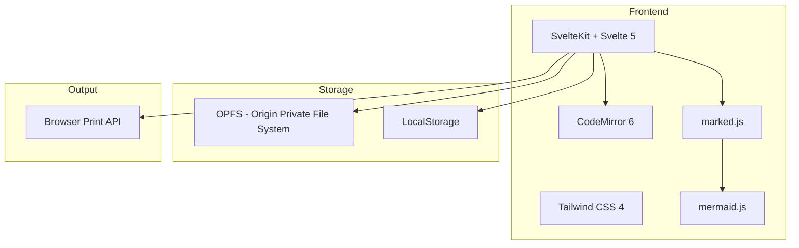

## Application Structure

```
md-to-pdf/
├── src/
│   ├── routes/
│   │   ├── +layout.svelte      # Root layout, store initialization
│   │   ├── +layout.ts          # SPA mode config (ssr: false)
│   │   └── +page.svelte        # Main application page
│   ├── lib/
│   │   ├── stores/             # State management
│   │   │   ├── files.svelte.ts # File operations store
│   │   │   ├── settings.svelte.ts # Document settings store
│   │   │   └── i18n.svelte.ts  # Internationalization store
│   │   ├── components/
│   │   │   ├── editor/         # CodeMirror markdown editor
│   │   │   ├── preview/        # Rendered markdown preview
│   │   │   ├── sidebar/        # File tree browser
│   │   │   ├── settings/       # Settings modal
│   │   │   └── ui/             # Reusable UI components
│   │   ├── utils/
│   │   │   ├── opfs.ts         # OPFS file system wrapper
│   │   │   ├── markdown.ts     # Markdown processing
│   │   │   └── cn.ts           # Class name utility
│   │   └── i18n/               # Translation files
│   │       ├── en.json
│   │       └── ar.json
│   └── app.css                 # Global styles, theming
├── static/                     # Static assets
└── svelte.config.js            # SvelteKit config (adapter-static)
```

## State Management

The application uses Svelte 5 runes (`$state`, `$derived`, `$effect`) for reactive state management.

### Store Architecture

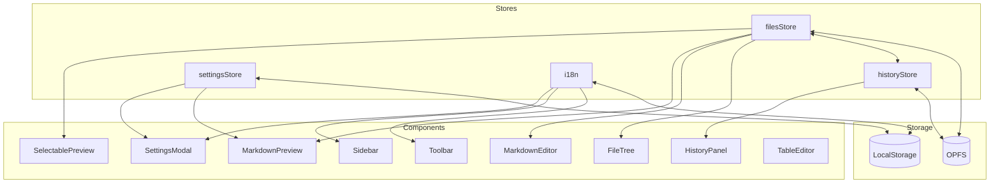

### Files Store (`files.svelte.ts`)

Manages file operations, auto-save, and current editor state.

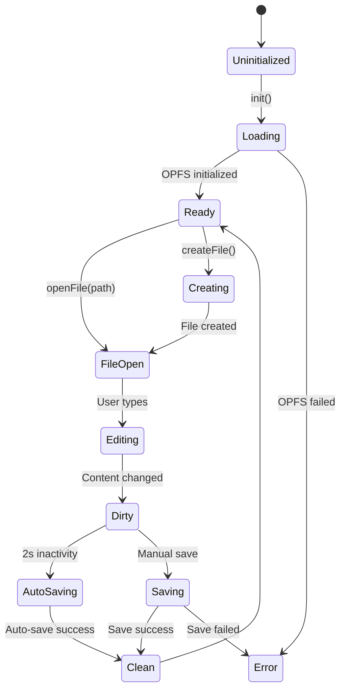

**State Properties:**

- `files: FileNode[]` - Tree of files and folders
- `currentFile: EditorFile | null` - Currently open file
- `isLoading: boolean` - Loading state
- `error: string | null` - Error message
- `autoSaveEnabled: boolean` - Auto-save toggle (default: true)

**Key Functions:**

- `init()` - Initialize OPFS, history store, and load file list
- `createFile(path, name)` - Create new markdown file
- `createFolder(path, name)` - Create new folder
- `openFile(path)` - Load and open file
- `saveCurrentFile()` - Save current file to OPFS (creates version)
- `updateContent(content)` - Update editor content (schedules auto-save)
- `deleteItem(path, isFolder)` - Delete file or folder
- `renameItem(oldPath, newName)` - Rename file or folder
- `restoreVersion(versionId)` - Restore file from version history
- `setAutoSave(enabled)` - Enable/disable auto-save

### History Store (`history.svelte.ts`)

Manages version history for files using OPFS.

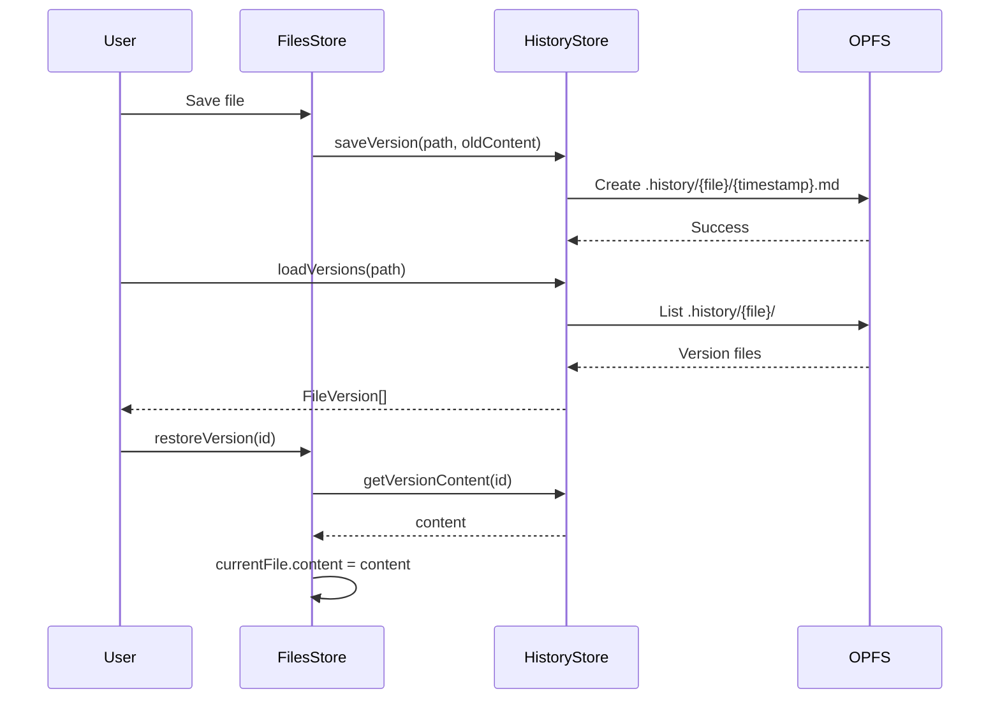

**State Properties:**

- `versions: FileVersion[]` - List of versions for current file
- `isLoading: boolean` - Loading state
- `currentFilePath: string | null` - File being viewed

**Key Functions:**

- `saveVersion(path, content)` - Save content as a version (1 min interval)
- `loadVersions(path)` - Load all versions for a file
- `getVersionContent(id)` - Get content of specific version
- `deleteVersion(id)` - Delete a version
- `clearHistory(path)` - Clear all history for a file

**Version Storage:**

```
.history/
├── document_md/
│   ├── 1704384000000-abc123.md
│   ├── 1704387600000-def456.md
│   └── 1704391200000-ghi789.md
└── notes_md/
    └── 1704394800000-jkl012.md
```

### Settings Store (`settings.svelte.ts`)

Manages per-document settings for PDF rendering.

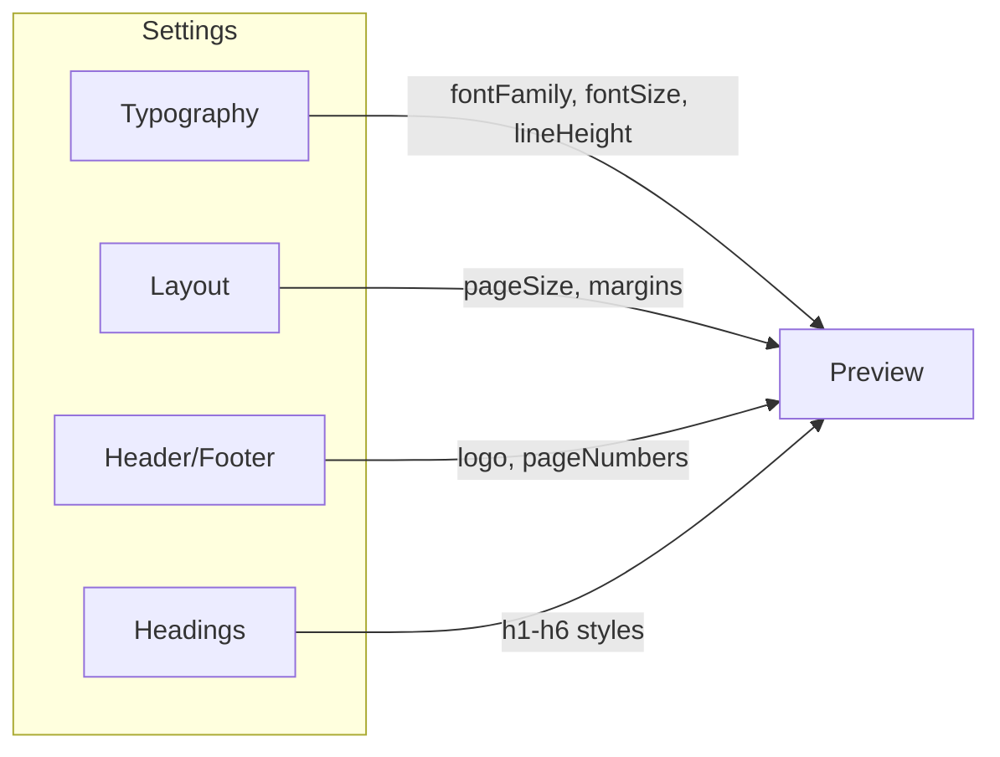

**State Properties:**

- `fontFamily` - Font for body text
- `fontSize` - Base font size (pt)
- `lineHeight` - Line height multiplier
- `pageSize` - A4, Letter, Legal
- `margins` - Top, bottom, left, right
- `header` - Logo, position, show on first page
- `footer` - Page numbers, format, custom text
- `headings` - Color, fontSize, borderBottom for h1-h6

### i18n Store (`i18n.svelte.ts`)

Manages language and RTL direction.

**State Properties:**

- `language: 'en' | 'ar'` - Current language
- `direction: 'ltr' | 'rtl'` - Text direction
- `t: Translations` - Translation strings

## Data Flow

### Editor → Preview Flow

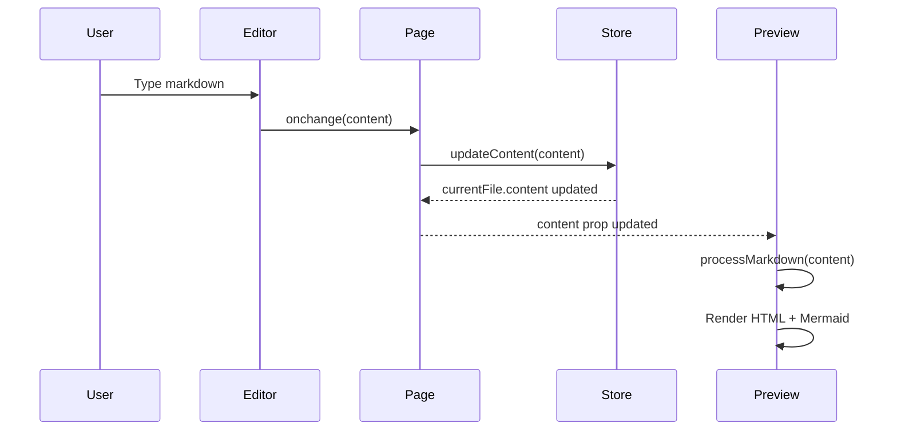

### File Create/Save Flow

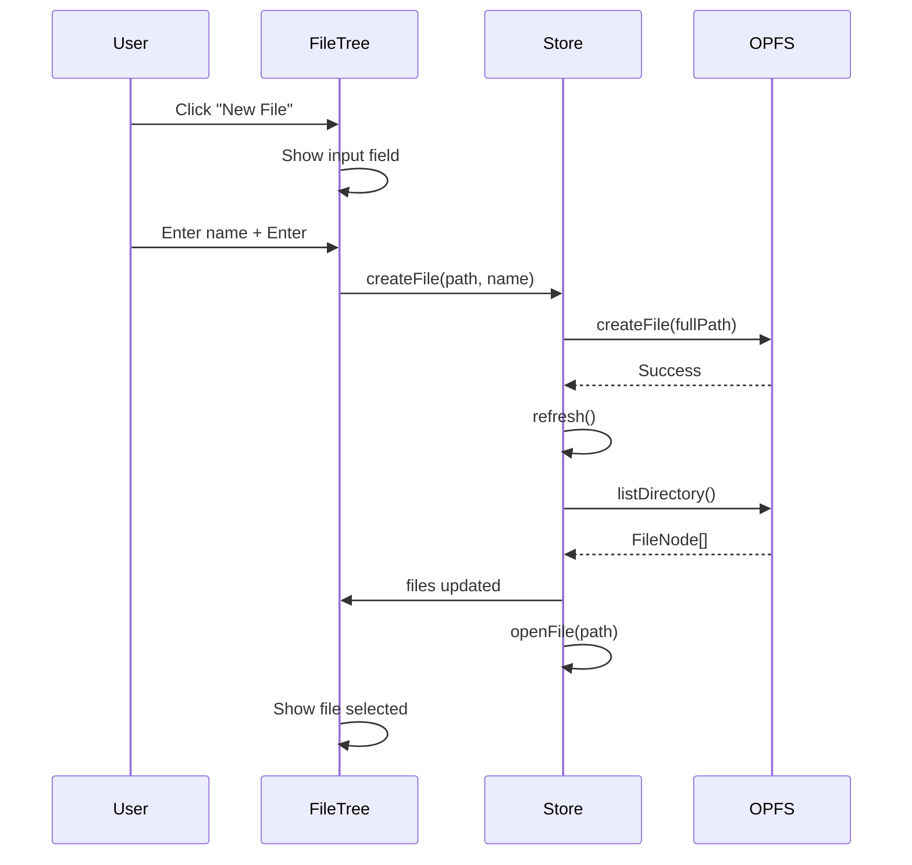

### Settings → PDF Export Flow

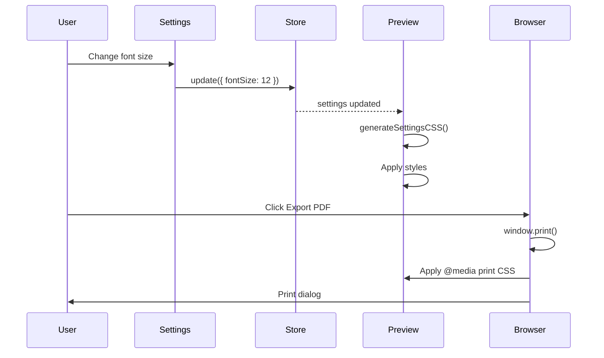

## Storage Architecture

### OPFS (Origin Private File System)

Used for storing markdown files and folders. Provides:

- Persistent storage (survives browser close)
- Hierarchical folder structure
- No size limits (within browser quota)
- Fast read/write operations

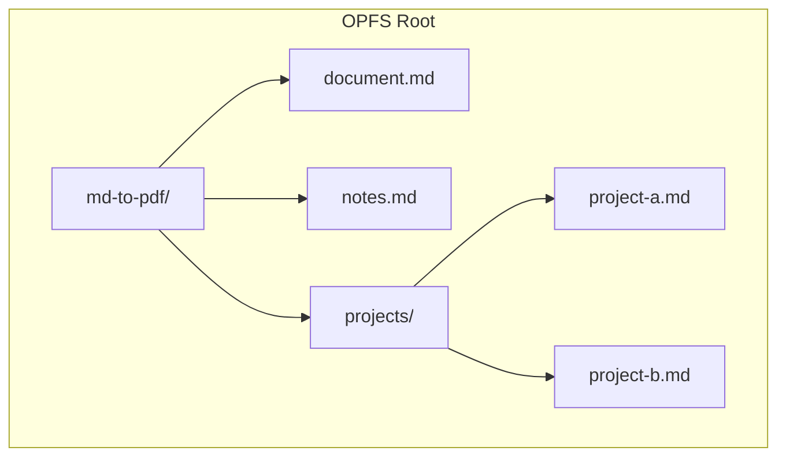

### LocalStorage

Used for:

- User preferences (language, theme)
- Document settings (fonts, margins, etc.)
- Last opened file path

**Keys:**

- `md-to-pdf-settings` - Document settings JSON
- `md-to-pdf-language` - Language preference
- `md-to-pdf-last-file` - Last opened file path

## Component Hierarchy

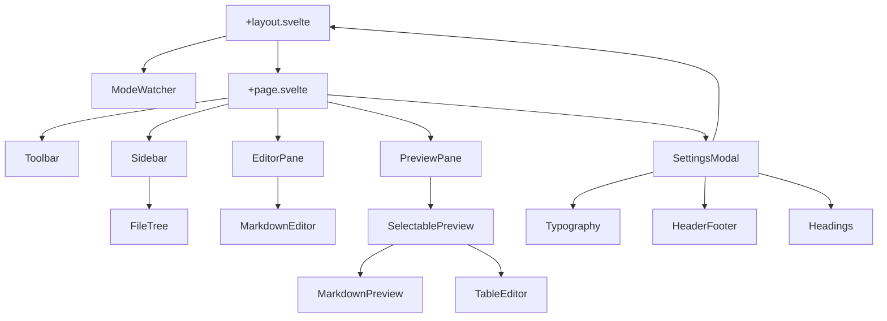

## RTL/LTR Handling

The application has three independent RTL/LTR contexts:

1. **App UI** - Controlled by `i18n.direction`, applied to toolbar and sidebar
2. **Editor** - Auto-detected per line using CodeMirror's `perLineTextDirection`
3. **Preview** - Auto-detected from content using Arabic character count

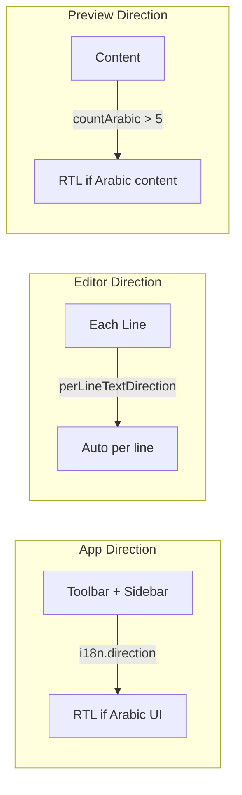

## Print/PDF Architecture

When exporting to PDF:

1. Browser's `window.print()` is called
2. `@media print` CSS hides editor, sidebar, toolbar
3. Preview pane becomes full-width
4. `overflow: visible` allows multi-page content
5. Page break rules applied to headings, tables, code blocks

```css
@media print {
	.editor-pane,
	.no-print {
		display: none;
	}
	.preview-pane {
		overflow: visible;
		height: auto;
	}
	h1,
	h2,
	h3 {
		page-break-after: avoid;
	}
	table,
	pre {
		page-break-inside: avoid;
	}
}
```

## Error Handling

Errors are managed at the store level and bubbled up to components:

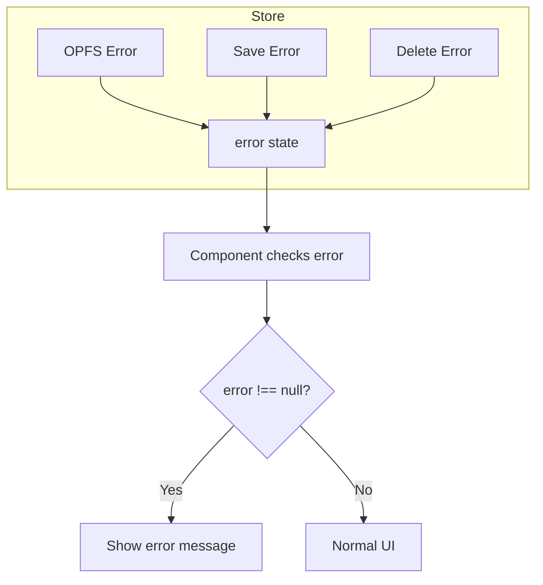

## Security Considerations

- **No Server** - All data stays in browser (OPFS + LocalStorage)
- **No External Requests** - Except for CDN assets if used
- **XSS Prevention** - Markdown rendered with safe defaults
- **Content Security** - Mermaid runs with `securityLevel: 'loose'` for diagram flexibility
