# MD-to-PDF Architecture

This document describes the architecture, state management, data flow, and collaborative features of the MD-to-PDF application.

## Overview

MD-to-PDF is a SvelteKit-based single-page application (SPA) that converts Markdown to PDF with full RTL (Arabic) language support and **real-time collaborative editing**. It runs entirely in the browser using OPFS (Origin Private File System) for persistent storage and LoroList CRDT for conflict-free collaboration.

## Technology Stack

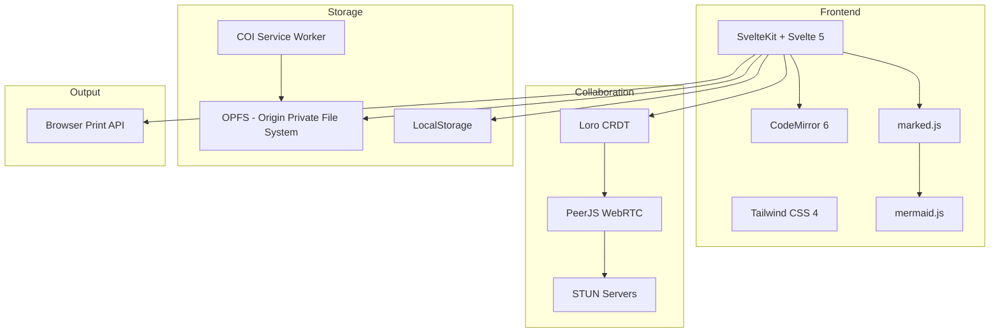
```mermaid
graph TB
    subgraph Frontend
        SK[SvelteKit + Svelte 5]
        TW[Tailwind CSS 4]
        CM[CodeMirror 6]
        MD[marked.js]
        MM[mermaid.js]
    end

    subgraph Collaboration
        LORO[Loro CRDT]
        PEER[PeerJS WebRTC]
        STUN[STUN Servers]
    end

    subgraph Storage
        OPFS[OPFS - Origin Private File System]
        LS[LocalStorage]
        COI[COI Service Worker]
    end

    subgraph Output
        PDF[Browser Print API]
    end

    SK --> CM
    SK --> MD
    MD --> MM
    SK --> LORO
    LORO --> PEER
    PEER --> STUN
    SK --> OPFS
    COI --> OPFS
    SK --> LS
    SK --> PDF
```

## Key Features

- **Collaborative Editing**: Real-time sync using Loro CRDT + PeerJS WebRTC
- **Persistent Storage**: OPFS for local file management
- **Cross-Origin Isolation**: Service worker enables OPFS on GitHub Pages
- **RTL Support**: Full Arabic language support
- **Version History**: Track file changes over time
- **No Backend Required**: Pure client-side application

---

## Application Structure

```
md-to-pdf/
├── src/
│   ├── routes/
│   │   ├── +layout.svelte      # Root layout, store initialization
│   │   ├── +layout.ts          # SPA mode config (ssr: false)
│   │   └── +page.svelte        # Main application page
│   ├── lib/
│   │   ├── stores/             # State management
│   │   │   ├── files.svelte.ts # File operations store
│   │   │   ├── loro.svelte.ts  # Collaboration & CRDT store
│   │   │   ├── history.svelte.ts # Version history store
│   │   │   ├── settings.svelte.ts # Document settings store
│   │   │   └── i18n.svelte.ts  # Internationalization store
│   │   ├── components/         # UI components
│   │   ├── utils/
│   │   │   ├── opfs.ts         # OPFS file system wrapper
│   │   │   ├── markdown.ts     # Markdown processing
│   │   │   └── cn.ts           # Class name utility
│   │   └── types/
│   │       └── file-system-access.d.ts # OPFS TypeScript declarations
│   ├── app.html                # Service worker registration
│   └── app.css                 # Global styles, theming
├── static/
│   └── coi-serviceworker.js    # Cross-origin isolation for OPFS
└── svelte.config.js            # SvelteKit config (adapter-static)
```

---

## State Management

The application uses Svelte 5 runes (`$state`, `$derived`, `$effect`) for reactive state management.

### Store Architecture

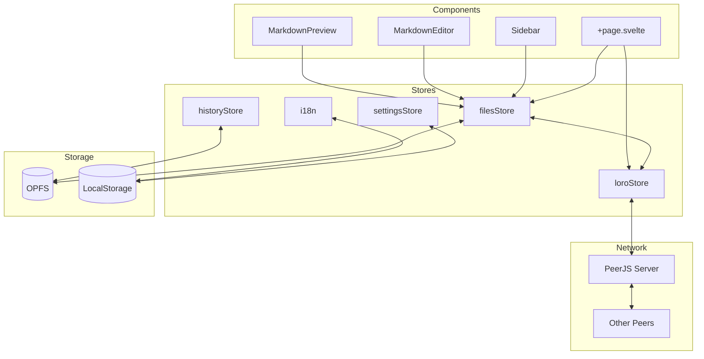
```mermaid
flowchart TB
    subgraph Stores
        FS[filesStore]
        LORO[loroStore]
        HS[historyStore]
        SS[settingsStore]
        I18N[i18n]
    end

    subgraph Storage
        OPFS[(OPFS)]
        LS[(LocalStorage)]
    end

    subgraph Network
        PEER[PeerJS Server]
        PEERS[Other Peers]
    end

    subgraph Components
        PAGE[+page.svelte]
        SB[Sidebar]
        ED[MarkdownEditor]
        PR[MarkdownPreview]
    end

    FS <--> OPFS
    FS <--> LORO
    LORO <--> PEER
    PEER <--> PEERS
    HS <--> OPFS
    SS <--> LS
    I18N <--> LS

    PAGE --> FS
    PAGE --> LORO
    SB --> FS
    ED --> FS
    PR --> FS
```

### Files Store (`files.svelte.ts`)

Manages file operations, auto-save, and current editor state.

**State Properties:**

- `files: FileNode[]` - Tree of files and folders
- `currentFile: EditorFile | null` - Currently open file
- `isLoading: boolean` - Loading state
- `error: string | null` - Error message
- `autoSaveEnabled: boolean` - Auto-save toggle (default: true)

**Key Functions:**

- `init()` - Initialize OPFS, history store, and load file list
- `setScope(scope)` - Set OPFS scope for room isolation
- `createFile(path, name)` - Create new markdown file
- `openFile(path)` - Load and open file
- `saveCurrentFile()` - Save current file to OPFS (creates version)
- `updateContent(content)` - Update editor content (schedules auto-save)
- `syncAllToLoro(files)` - Sync local files to Loro CRDT

**Logging** (prefix: `[FilesStore]`):

- Remote change detection
- File sync operations
- OPFS read/write operations
- Loro synchronization

### Loro Store (`loro.svelte.ts`)

Manages CRDT (Conflict-free Replicated Data Type) and P2P connections.

**State Properties:**

- `doc: LoroDoc` - CRDT document
- `ephemeral: EphemeralStore` - Presence/awareness data
- `filesMap: LoroMap` - Map of all files
- `awareness: PeerState[]` - List of connected peers
- `connections: SvelteMap<string, DataConnection>` - Active P2P connections
- `roomId: string | null` - Current collaboration room
- `isHost: boolean` - Whether this peer is the host

**Key Functions:**

- `joinRoom(roomId)` - Join or create a collaboration room
- `setFile(path, content)` - Set file content in CRDT
- `getFile(path)` - Get file content from CRDT
- `listFiles()` - List all files in CRDT
- `setChangeCallback(cb)` - Register callback for remote changes

**Logging** (prefix: `[LoroStore]`):

- Room joining/hosting
- PeerJS connection lifecycle
- ICE candidate gathering
- Data sync operations
- Error handling

---

## Collaborative Editing Architecture

### Room-Based Collaboration

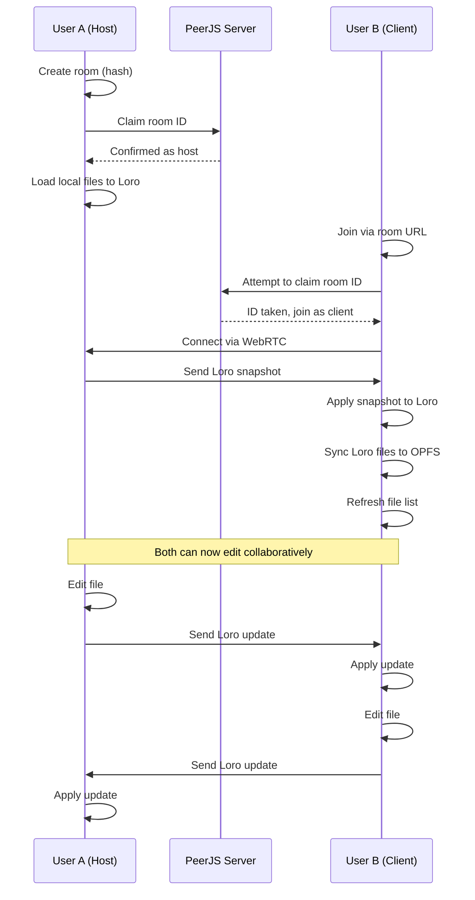
```mermaid
sequenceDiagram
    participant UserA as User A (Host)
    participant PeerServer as PeerJS Server
    participant UserB as User B (Client)

    UserA->>UserA: Create room (hash)
    UserA->>PeerServer: Claim room ID
    PeerServer-->>UserA: Confirmed as host
    UserA->>UserA: Load local files to Loro

    UserB->>UserB: Join via room URL
    UserB->>PeerServer: Attempt to claim room ID
    PeerServer-->>UserB: ID taken, join as client
    UserB->>UserA: Connect via WebRTC

    UserA->>UserB: Send Loro snapshot
    UserB->>UserB: Apply snapshot to Loro
    UserB->>UserB: Sync Loro files to OPFS
    UserB->>UserB: Refresh file list

    Note over UserA,UserB: Both can now edit collaboratively

    UserA->>UserA: Edit file
    UserA->>UserB: Send Loro update
    UserB->>UserB: Apply update

    UserB->>UserB: Edit file
    UserB->>UserA: Send Loro update
    UserA->>UserA: Apply update
```

### CRDT Conflict Resolution

Loro uses a CRDT algorithm that automatically resolves conflicts:

- **Last-write-wins** for simple text
- **Operational transforms** for concurrent edits
- **Vector clocks** for causality tracking

### File Isolation by Room

Each collaboration room has isolated storage:

```
OPFS Root/
└── md-to-pdf/
    ├── rooms/
    │   ├── room-abc-123/
    │   │   ├── file1.md
    │   │   └── file2.md
    │   └── room-xyz-789/
    │       └── doc.md
    └── (default files - no room)
        └── local-only.md
```

---

## Cross-Origin Isolation for OPFS

### Problem

Origin Private File System (OPFS) requires cross-origin isolation headers:

- `Cross-Origin-Embedder-Policy: require-corp`
- `Cross-Origin-Opener-Policy: same-origin`

GitHub Pages doesn't support custom headers.

### Solution: COI Service Worker

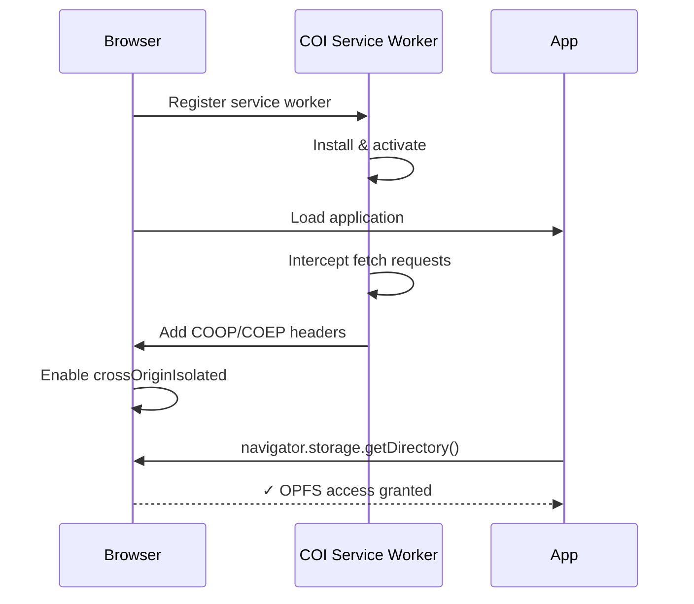
```mermaid
sequenceDiagram
    participant Browser
    participant SW as COI Service Worker
    participant App

    Browser->>SW: Register service worker
    SW->>SW: Install & activate
    Browser->>App: Load application
    SW->>SW: Intercept fetch requests
    SW->>Browser: Add COOP/COEP headers
    Browser->>Browser: Enable crossOriginIsolated
    App->>Browser: navigator.storage.getDirectory()
    Browser-->>App: ✓ OPFS access granted
```

**Implementation**: `static/coi-serviceworker.js`

- Intercepts all fetch requests
- Adds required headers to responses
- Enables `crossOriginIsolated` globally

**Registration**: `src/app.html`

- Registers service worker on page load
- Auto-reloads once when isolation activated

---

## PeerJS Connection Architecture

### ICE Negotiation

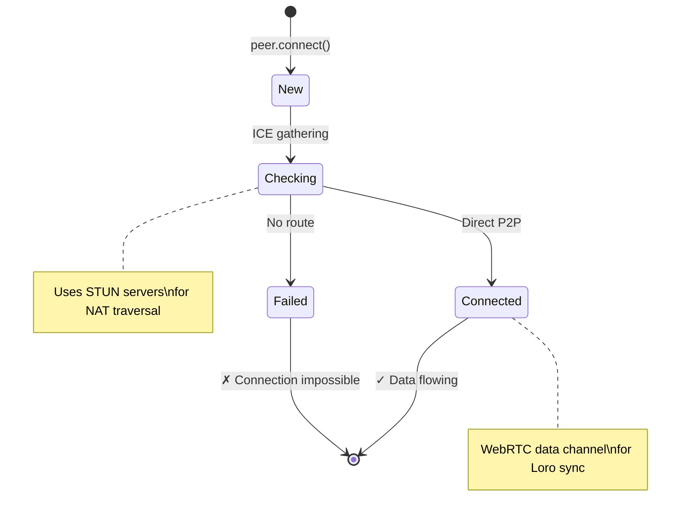
```mermaid
stateDiagram-v2
    [*] --> New: peer.connect()
    New --> Checking: ICE gathering
    Checking --> Connected: Direct P2P
    Checking --> Failed: No route
    Connected --> [*]: ✓ Data flowing
    Failed --> [*]: ✗ Connection impossible

    Note right of Checking: Uses STUN servers\nfor NAT traversal
    Note right of Connected: WebRTC data channel\nfor Loro sync
```

### STUN Server Configuration

Currently using **6 STUN servers** for redundancy:

- `stun.l.google.com:19302` (primary)
- `stun1-4.l.google.com:19302` (fallbacks)
- `stun.cloudflare.com:3478`

**No TURN servers** configured (requires credentials).

For production, consider adding TURN for relay:

- Twilio STUN/TURN
- Xirsys
- Cloudflare Calls
- Self-hosted coturn

---

## Data Flow

### Initialization Flow

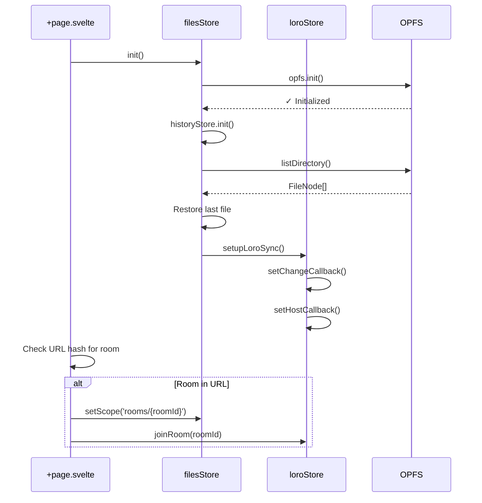
```mermaid
sequenceDiagram
    participant Page as +page.svelte
    participant Files as filesStore
    participant Loro as loroStore
    participant OPFS

    Page->>Files: init()
    Files->>OPFS: opfs.init()
    OPFS-->>Files: ✓ Initialized
    Files->>Files: historyStore.init()
    Files->>OPFS: listDirectory()
    OPFS-->>Files: FileNode[]
    Files->>Files: Restore last file
    Files->>Loro: setupLoroSync()
    Loro->>Loro: setChangeCallback()
    Loro->>Loro: setHostCallback()
    Page->>Page: Check URL hash for room
    alt Room in URL
        Page->>Files: setScope('rooms/{roomId}')
        Page->>Loro: joinRoom(roomId)
    end
```

### File Edit & Save Flow (Local Only)

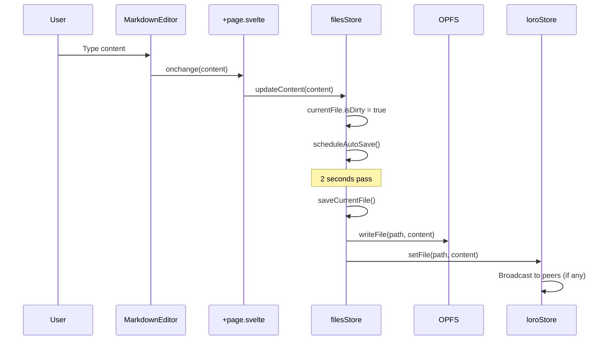
```mermaid
sequenceDiagram
    participant User
    participant Editor as MarkdownEditor
    participant Page as +page.svelte
    participant Files as filesStore
    participant OPFS
    participant Loro as loroStore

    User->>Editor: Type content
    Editor->>Page: onchange(content)
    Page->>Files: updateContent(content)
    Files->>Files: currentFile.isDirty = true
    Files->>Files: scheduleAutoSave()

    Note over Files: 2 seconds pass

    Files->>Files: saveCurrentFile()
    Files->>OPFS: writeFile(path, content)
    Files->>Loro: setFile(path, content)
    Loro->>Loro: Broadcast to peers (if any)
```

### Collaborative Edit Flow

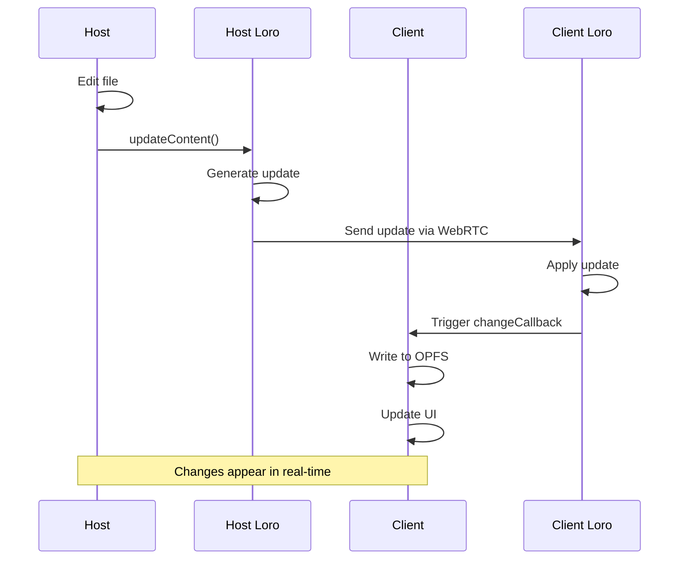
```mermaid
sequenceDiagram
    participant Host
    participant HostLoro as Host Loro
    participant Client
    participant ClientLoro as Client Loro

    Host->>Host: Edit file
    Host->>HostLoro: updateContent()
    HostLoro->>HostLoro: Generate update
    HostLoro->>ClientLoro: Send update via WebRTC
    ClientLoro->>ClientLoro: Apply update
    ClientLoro->>Client: Trigger changeCallback
    Client->>Client: Write to OPFS
    Client->>Client: Update UI

    Note over Host,Client: Changes appear in real-time
```

---

## Logging Strategy

### Log Prefixes

All console logs use prefixes for easy filtering:

| Prefix           | Component              | Purpose                |
| ---------------- | ---------------------- | ---------------------- |
| `[COI]`          | Cross-Origin Isolation | Service worker status  |
| `[OPFS]`         | OPFS Manager           | File system operations |
| `[FilesStore]`   | Files Store            | File management & sync |
| `[LoroStore]`    | Loro Store             | CRDT operations & P2P  |
| `[HistoryStore]` | History Store          | Version management     |
| `[Page]`         | Page Component         | Lifecycle & routing    |

### Filtering Logs in DevTools

```javascript
// Show only OPFS logs
/\[OPFS\]/

// Show only connection logs
/\[LoroStore\].*connection/i

// Show all collaboration logs
/\[(FilesStore|LoroStore)\]./

// Hide verbose logs
!/ICE candidate/
```

### Critical Log Messages

**Successful initialization:**

```
[COI] Already cross-origin isolated
[OPFS] Successfully initialized. Cross-origin isolated: true
[LoroStore] Successfully claimed Room ID. I am Host: <id>
[LoroStore] ✓ Connection ESTABLISHED with: <peer-id>
```

**Connection issues:**

```
[LoroStore] ICE connection failed/disconnected
[LoroStore] Connection failed completely
ERROR PeerJS: Lost connection to server
```

**Sync issues:**

```
[FilesStore] Skipping initial sync. Conditions met? false
[FilesStore] Error applying remote changes
```

---

## Error Handling

### OPFS Errors

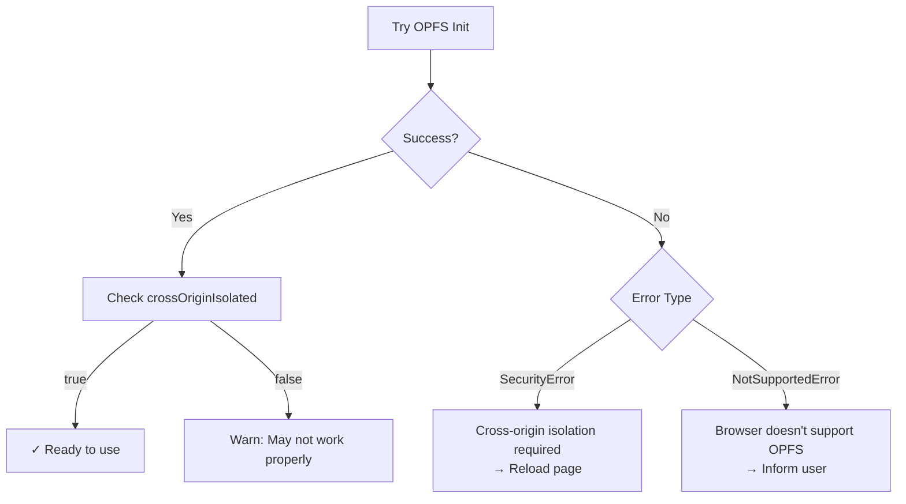
```mermaid
flowchart TD
    A[Try OPFS Init] --> B{Success?}
    B -->|Yes| C[Check crossOriginIsolated]
    B -->|No| D{Error Type}

    D -->|SecurityError| E[Cross-origin isolation required<br/>→ Reload page]
    D -->|NotSupportedError| F[Browser doesn't support OPFS<br/>→ Inform user]

    C -->|true| G[✓ Ready to use]
    C -->|false| H[Warn: May not work properly]
```

### PeerJS ErrorsCheck error type and provide specific guidance:

- `network` - Check internet connection
- `server-error` - PeerJS server down, retry
- `socket-error`/`socket-closed` - Connection lost
- `unavailable-id` - Expected when joining as client

### Storage Fallback

Currently, **no fallback** to IndexedDB or localStorage. Future enhancement.

---

## Troubleshooting Guide

### Issue: Files Don't Sync Between Peers

**Symptoms:**

- Host creates file, client sidebar stays empty
- ICE state stays at "new", never reaches "connected"

**Diagnosis:**

```javascript
// In console, check:
loroStore.connections; // Should show peer connections
loroStore.isHost; // Should be true on one peer, false on others
crossOriginIsolated; // Should be true
```

**Possible causes:**

1. **WebRTC blocked** - Corporate firewall, VPN
2. **No TURN server** - Direct P2P failed, need relay
3. **Different networks** - Use TURN server

**Logs to watch:**

```
[LoroStore] ICE connection state changed to: checking
[LoroStore] ICE candidate: host/srflx/relay
[LoroStore] ✓ Connection ESTABLISHED
```

### Issue: OPFS Access Denied

**Symptoms:**

```
Failed to initialize OPFS: DOMException: Security error
```

**Solution:**

1. Check `crossOriginIsolated` in console (should be `true`)
2. Hard refresh page (Cmd+Shift+R)
3. Clear service worker and reload
4. Check browser supports OPFS (Chrome 86+, Firefox 111+, Safari 15.2+)

### Issue: Service Worker Not Registering

**Symptoms:**

```
[COI] Service worker registration failed
```

**Solution:**

1. Ensure HTTPS (or localhost)
2. Check browser DevTools → Application → Service Workers
3. Unregister old workers
4. Clear cache and reload

---

## Browser Compatibility

| Feature                | Chrome | Firefox | Safari | Edge |
| ---------------------- | ------ | ------- | ------ | ---- |
| OPFS                   | 86+    | 111+    | 15.2+  | 86+  |
| Service Workers        | ✅     | ✅      | ✅     | ✅   |
| WebRTC                 | ✅     | ✅      | ⚠️     | ✅   |
| Cross-Origin Isolation | ✅     | ✅      | ✅     | ✅   |

⚠️ Safari: May have stricter WebRTC restrictions

---

## Performance Considerations

### File Size Limits

- **OPFS**: Limited by browser quota (typically GBs)
- **Loro CRDT**: Grows with edit history
- **WebRTC**: Max message size ~256KB (chunking needed for large files)

### Optimization Strategies

1. **Lazy load** history versions
2. **Compress** Loro snapshots before sending
3. **Debounce** OPFS writes (already implemented via auto save)
4. **Prune** old Loro history periodically

---

## Security Considerations

- **No Server** - All data stays in browser (OPFS + LocalStorage)
- **P2P Encryption** - WebRTC uses DTLS/SRTP
- **No Authentication** - Anyone with room URL can join
- **XSS Prevention** - Markdown rendered with safe defaults
- **Content Security** - Mermaid runs with `securityLevel: 'loose'` for diagram flexibility

**Future**: Add password protection for rooms, end-to-end encryption

---

## Deployment

### Build for Production

```bash
pnpm build
```

Output: `build/` directory

### GitHub Pages

1. Build creates static site in `build/`
2. Service worker enables OPFS via COI headers
3. Base path configured in `svelte.config.js`

### Verification

After deployment:

1. Check console for `[COI] Already cross-origin isolated`
2. Check `crossOriginIsolated === true`
3. Test file creation and persistence
4. Test room joining from multiple devices

---

## Future Enhancements

1. **TURN Server Integration** - Reliable relay for all networks
2. **IndexedDB Fallback** - When OPFS unavailable
3. **End-to-End Encryption** - Encrypt before sending via WebRTC
4. **Room Passwords** - Protect collaboration sessions
5. **Persistent Rooms** - Use server to persist room state
6. **Cursor Sharing** - Show where others are editing
7. **Voice/Video Chat** - Add WebRTC media streams
8. **Mobile App** - PWA with better mobile UX

This document describes the architecture, state management, and data flow of the MD-to-PDF application.

## Overview

MD-to-PDF is a SvelteKit-based single-page application (SPA) that converts Markdown to PDF with full RTL (Arabic) language support. It runs entirely in the browser using OPFS (Origin Private File System) for persistent storage.

## Technology Stack

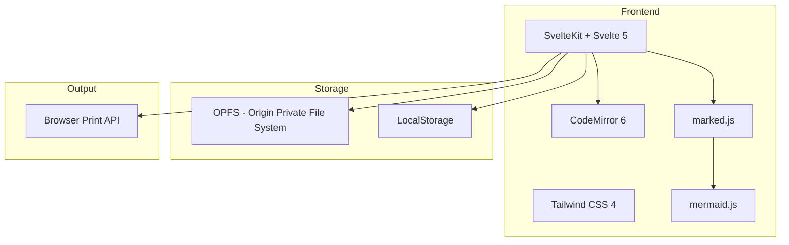
```mermaid
graph TB
    subgraph Frontend
        SK[SvelteKit + Svelte 5]
        TW[Tailwind CSS 4]
        CM[CodeMirror 6]
        MD[marked.js]
        MM[mermaid.js]
    end

    subgraph Storage
        OPFS[OPFS - Origin Private File System]
        LS[LocalStorage]
    end

    subgraph Output
        PDF[Browser Print API]
    end

    SK --> CM
    SK --> MD
    MD --> MM
    SK --> OPFS
    SK --> LS
    SK --> PDF
```

## Application Structure

```
md-to-pdf/
├── src/
│   ├── routes/
│   │   ├── +layout.svelte      # Root layout, store initialization
│   │   ├── +layout.ts          # SPA mode config (ssr: false)
│   │   └── +page.svelte        # Main application page
│   ├── lib/
│   │   ├── stores/             # State management
│   │   │   ├── files.svelte.ts # File operations store
│   │   │   ├── settings.svelte.ts # Document settings store
│   │   │   └── i18n.svelte.ts  # Internationalization store
│   │   ├── components/
│   │   │   ├── editor/         # CodeMirror markdown editor
│   │   │   ├── preview/        # Rendered markdown preview
│   │   │   ├── sidebar/        # File tree browser
│   │   │   ├── settings/       # Settings modal
│   │   │   └── ui/             # Reusable UI components
│   │   ├── utils/
│   │   │   ├── opfs.ts         # OPFS file system wrapper
│   │   │   ├── markdown.ts     # Markdown processing
│   │   │   └── cn.ts           # Class name utility
│   │   └── i18n/               # Translation files
│   │       ├── en.json
│   │       └── ar.json
│   └── app.css                 # Global styles, theming
├── static/                     # Static assets
└── svelte.config.js            # SvelteKit config (adapter-static)
```

## State Management

The application uses Svelte 5 runes (`$state`, `$derived`, `$effect`) for reactive state management.

### Store Architecture

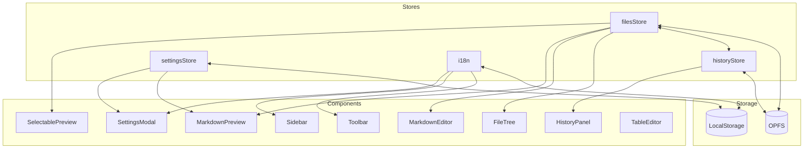
```mermaid
flowchart TB
    subgraph Stores
        FS[filesStore]
        HS[historyStore]
        SS[settingsStore]
        I18N[i18n]
    end

    subgraph Storage
        OPFS[(OPFS)]
        LS[(LocalStorage)]
    end

    subgraph Components
        SB[Sidebar]
        FT[FileTree]
        HP[HistoryPanel]
        ED[MarkdownEditor]
        PR[MarkdownPreview]
        SM[SettingsModal]
        TB[Toolbar]
        SP[SelectablePreview]
        TE[TableEditor]
    end

    FS <--> OPFS
    FS <--> HS
    HS <--> OPFS
    FS --> FT
    FS --> ED
    FS --> PR
    FS --> SP
    HS --> HP

    SS <--> LS
    SS --> PR
    SS --> SM

    I18N <--> LS
    I18N --> TB
    I18N --> SB
    I18N --> SM
```

### Files Store (`files.svelte.ts`)

Manages file operations, auto-save, and current editor state.

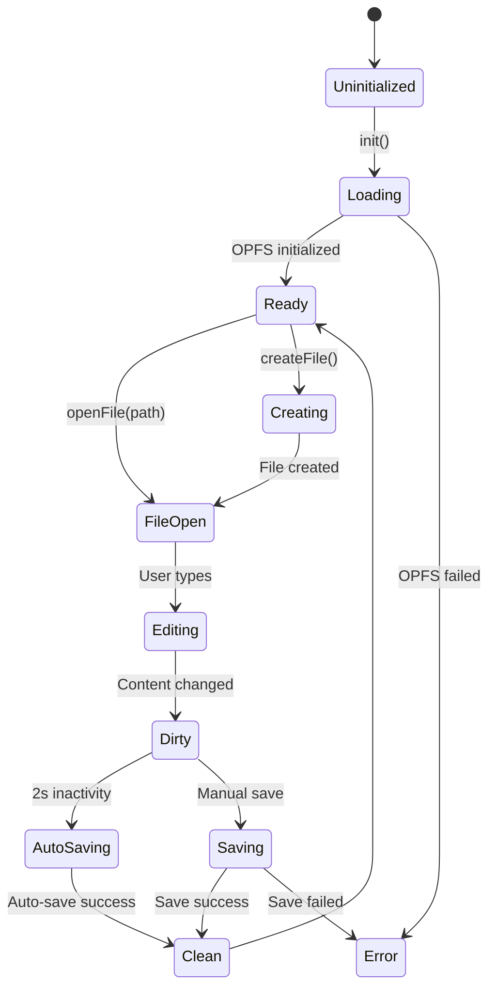
```mermaid
stateDiagram-v2
    [*] --> Uninitialized
    Uninitialized --> Loading: init()
    Loading --> Ready: OPFS initialized
    Loading --> Error: OPFS failed

    Ready --> FileOpen: openFile(path)
    FileOpen --> Editing: User types
    Editing --> Dirty: Content changed
    Dirty --> AutoSaving: 2s inactivity
    AutoSaving --> Clean: Auto-save success
    Dirty --> Saving: Manual save
    Saving --> Clean: Save success
    Saving --> Error: Save failed
    Clean --> Ready

    Ready --> Creating: createFile()
    Creating --> FileOpen: File created
```

**State Properties:**

- `files: FileNode[]` - Tree of files and folders
- `currentFile: EditorFile | null` - Currently open file
- `isLoading: boolean` - Loading state
- `error: string | null` - Error message
- `autoSaveEnabled: boolean` - Auto-save toggle (default: true)

**Key Functions:**

- `init()` - Initialize OPFS, history store, and load file list
- `createFile(path, name)` - Create new markdown file
- `createFolder(path, name)` - Create new folder
- `openFile(path)` - Load and open file
- `saveCurrentFile()` - Save current file to OPFS (creates version)
- `updateContent(content)` - Update editor content (schedules auto-save)
- `deleteItem(path, isFolder)` - Delete file or folder
- `renameItem(oldPath, newName)` - Rename file or folder
- `restoreVersion(versionId)` - Restore file from version history
- `setAutoSave(enabled)` - Enable/disable auto-save

### History Store (`history.svelte.ts`)

Manages version history for files using OPFS.

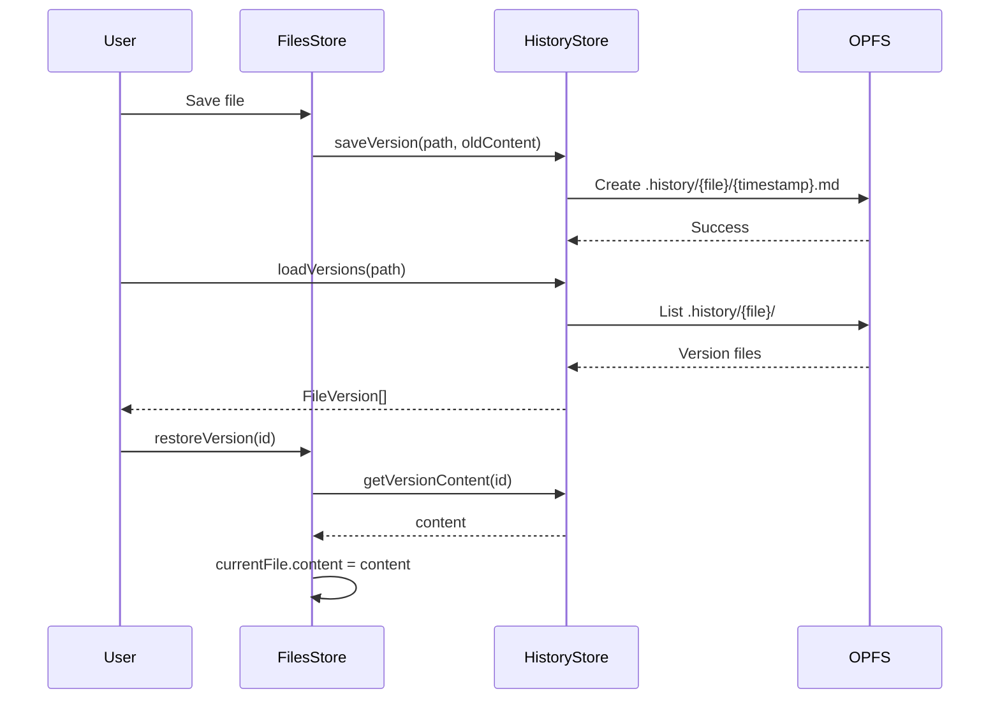
```mermaid
sequenceDiagram
    participant User
    participant FilesStore
    participant HistoryStore
    participant OPFS

    User->>FilesStore: Save file
    FilesStore->>HistoryStore: saveVersion(path, oldContent)
    HistoryStore->>OPFS: Create .history/{file}/{timestamp}.md
    OPFS-->>HistoryStore: Success

    User->>HistoryStore: loadVersions(path)
    HistoryStore->>OPFS: List .history/{file}/
    OPFS-->>HistoryStore: Version files
    HistoryStore-->>User: FileVersion[]

    User->>FilesStore: restoreVersion(id)
    FilesStore->>HistoryStore: getVersionContent(id)
    HistoryStore-->>FilesStore: content
    FilesStore->>FilesStore: currentFile.content = content
```

**State Properties:**

- `versions: FileVersion[]` - List of versions for current file
- `isLoading: boolean` - Loading state
- `currentFilePath: string | null` - File being viewed

**Key Functions:**

- `saveVersion(path, content)` - Save content as a version (1 min interval)
- `loadVersions(path)` - Load all versions for a file
- `getVersionContent(id)` - Get content of specific version
- `deleteVersion(id)` - Delete a version
- `clearHistory(path)` - Clear all history for a file

**Version Storage:**

```
.history/
├── document_md/
│   ├── 1704384000000-abc123.md
│   ├── 1704387600000-def456.md
│   └── 1704391200000-ghi789.md
└── notes_md/
    └── 1704394800000-jkl012.md
```

### Settings Store (`settings.svelte.ts`)

Manages per-document settings for PDF rendering.

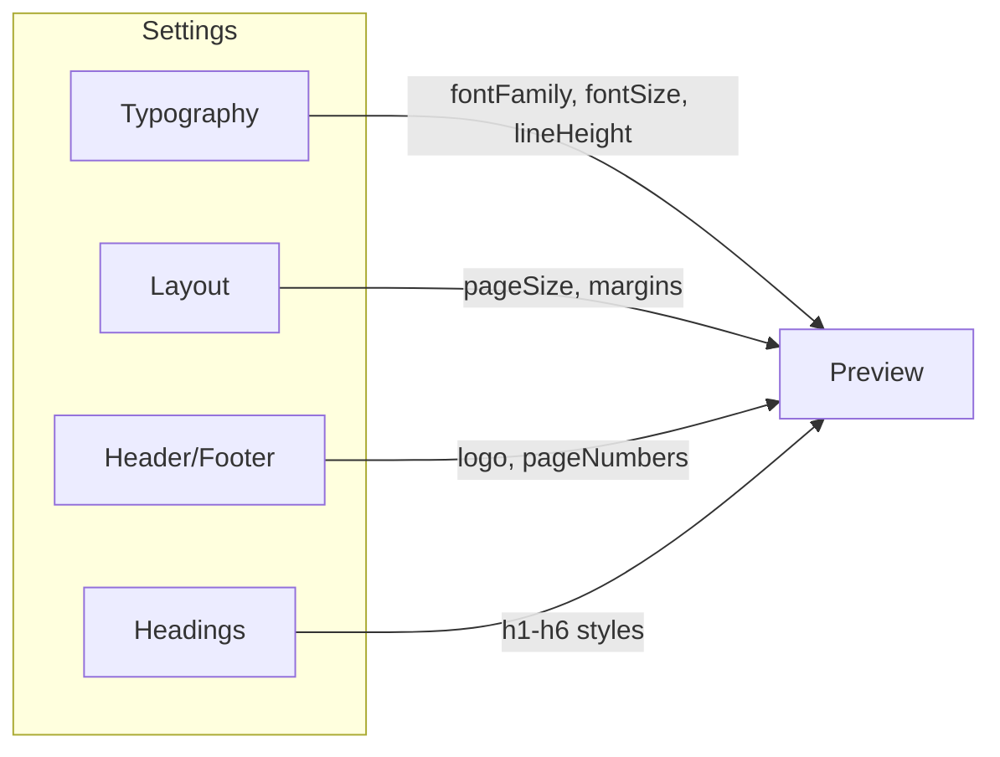
```mermaid
graph LR
    subgraph Settings
        TY[Typography]
        LY[Layout]
        HD[Header/Footer]
        HG[Headings]
    end

    TY --> |fontFamily, fontSize, lineHeight| Preview
    LY --> |pageSize, margins| Preview
    HD --> |logo, pageNumbers| Preview
    HG --> |h1-h6 styles| Preview
```

**State Properties:**

- `fontFamily` - Font for body text
- `fontSize` - Base font size (pt)
- `lineHeight` - Line height multiplier
- `pageSize` - A4, Letter, Legal
- `margins` - Top, bottom, left, right
- `header` - Logo, position, show on first page
- `footer` - Page numbers, format, custom text
- `headings` - Color, fontSize, borderBottom for h1-h6

### i18n Store (`i18n.svelte.ts`)

Manages language and RTL direction.

**State Properties:**

- `language: 'en' | 'ar'` - Current language
- `direction: 'ltr' | 'rtl'` - Text direction
- `t: Translations` - Translation strings

## Data Flow

### Editor → Preview Flow

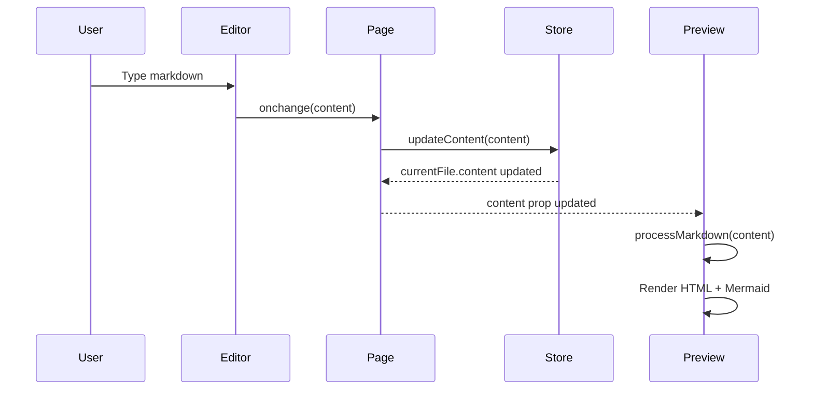
```mermaid
sequenceDiagram
    participant User
    participant Editor
    participant Page
    participant Store
    participant Preview

    User->>Editor: Type markdown
    Editor->>Page: onchange(content)
    Page->>Store: updateContent(content)
    Store-->>Page: currentFile.content updated
    Page-->>Preview: content prop updated
    Preview->>Preview: processMarkdown(content)
    Preview->>Preview: Render HTML + Mermaid
```

### File Create/Save Flow

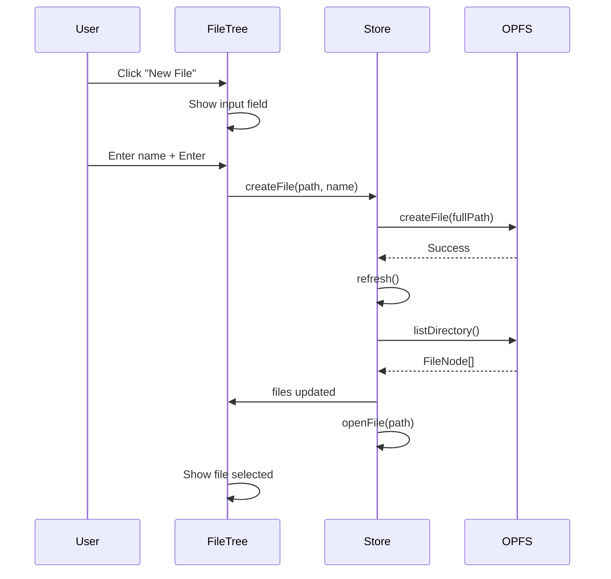
```mermaid
sequenceDiagram
    participant User
    participant FileTree
    participant Store
    participant OPFS

    User->>FileTree: Click "New File"
    FileTree->>FileTree: Show input field
    User->>FileTree: Enter name + Enter
    FileTree->>Store: createFile(path, name)
    Store->>OPFS: createFile(fullPath)
    OPFS-->>Store: Success
    Store->>Store: refresh()
    Store->>OPFS: listDirectory()
    OPFS-->>Store: FileNode[]
    Store->>FileTree: files updated
    Store->>Store: openFile(path)
    FileTree->>FileTree: Show file selected
```

### Settings → PDF Export Flow

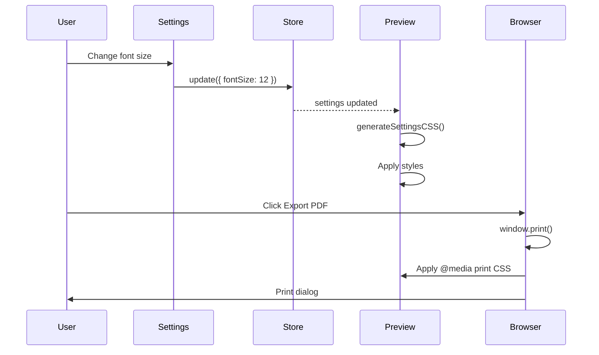
```mermaid
sequenceDiagram
    participant User
    participant Settings
    participant Store
    participant Preview
    participant Browser

    User->>Settings: Change font size
    Settings->>Store: update({ fontSize: 12 })
    Store-->>Preview: settings updated
    Preview->>Preview: generateSettingsCSS()
    Preview->>Preview: Apply styles

    User->>Browser: Click Export PDF
    Browser->>Browser: window.print()
    Browser->>Preview: Apply @media print CSS
    Browser->>User: Print dialog
```

## Storage Architecture

### OPFS (Origin Private File System)

Used for storing markdown files and folders. Provides:

- Persistent storage (survives browser close)
- Hierarchical folder structure
- No size limits (within browser quota)
- Fast read/write operations

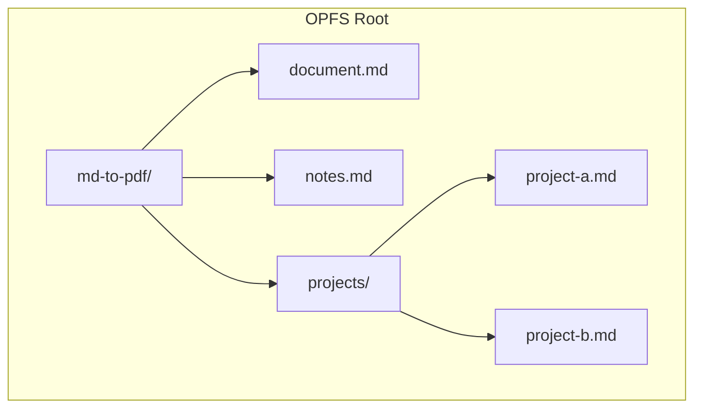
```mermaid
graph TB
    subgraph OPFS["OPFS Root"]
        MD[md-to-pdf/]
        MD --> F1[document.md]
        MD --> F2[notes.md]
        MD --> D1[projects/]
        D1 --> F3[project-a.md]
        D1 --> F4[project-b.md]
    end
```

### LocalStorage

Used for:

- User preferences (language, theme)
- Document settings (fonts, margins, etc.)
- Last opened file path

**Keys:**

- `md-to-pdf-settings` - Document settings JSON
- `md-to-pdf-language` - Language preference
- `md-to-pdf-last-file` - Last opened file path

## Component Hierarchy

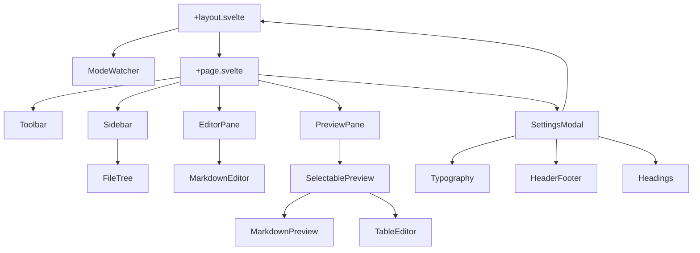
```mermaid
graph TB
    Layout[+layout.svelte]
    Layout --> ModeWatcher
    Layout --> Page[+page.svelte]

    Page --> Toolbar
    Page --> Sidebar
    Page --> EditorPane
    Page --> PreviewPane
    Page --> SettingsModal

    Sidebar --> FileTree
    EditorPane --> MarkdownEditor
    PreviewPane --> SelectablePreview
    SelectablePreview --> MarkdownPreview
    SelectablePreview --> TableEditor

    SettingsModal --> Typography
    SettingsModal --> Layout
    SettingsModal --> HeaderFooter
    SettingsModal --> Headings
```

## RTL/LTR Handling

The application has three independent RTL/LTR contexts:

1. **App UI** - Controlled by `i18n.direction`, applied to toolbar and sidebar
2. **Editor** - Auto-detected per line using CodeMirror's `perLineTextDirection`
3. **Preview** - Auto-detected from content using Arabic character count

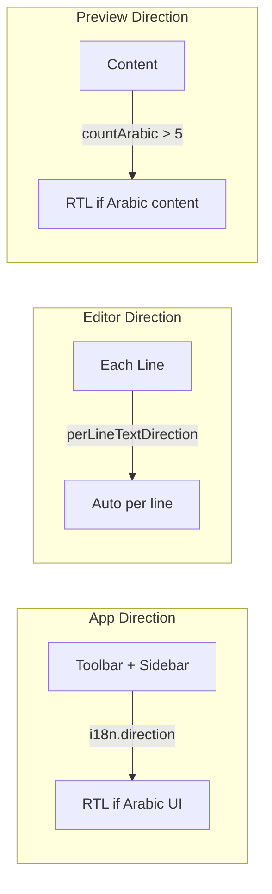
```mermaid
graph LR
    subgraph "App Direction"
        UI[Toolbar + Sidebar]
        UI --> |i18n.direction| RTL1[RTL if Arabic UI]
    end

    subgraph "Editor Direction"
        ED[Each Line]
        ED --> |perLineTextDirection| RTL2[Auto per line]
    end

    subgraph "Preview Direction"
        PR[Content]
        PR --> |countArabic > 5| RTL3[RTL if Arabic content]
    end
```

## Print/PDF Architecture

When exporting to PDF:

1. Browser's `window.print()` is called
2. `@media print` CSS hides editor, sidebar, toolbar
3. Preview pane becomes full-width
4. `overflow: visible` allows multi-page content
5. Page break rules applied to headings, tables, code blocks

```css
@media print {
	.editor-pane,
	.no-print {
		display: none;
	}
	.preview-pane {
		overflow: visible;
		height: auto;
	}
	h1,
	h2,
	h3 {
		page-break-after: avoid;
	}
	table,
	pre {
		page-break-inside: avoid;
	}
}
```

## Error Handling

Errors are managed at the store level and bubbled up to components:

```mermaid
flowchart TB
    subgraph Store
        E1[OPFS Error] --> ERR[error state]
        E2[Save Error] --> ERR
        E3[Delete Error] --> ERR
    end

    ERR --> C1[Component checks error]
    C1 --> D1{error !== null?}
    D1 --> |Yes| SHOW[Show error message]
    D1 --> |No| HIDE[Normal UI]
```

## Security Considerations

- **No Server** - All data stays in browser (OPFS + LocalStorage)
- **No External Requests** - Except for CDN assets if used
- **XSS Prevention** - Markdown rendered with safe defaults
- **Content Security** - Mermaid runs with `securityLevel: 'loose'` for diagram flexibility
